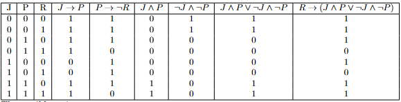

# LogicToLatexTable
This program reads logical formulas containing variables and creates a truth table in LaTeX format. This repository contains a logic interpreter that is used to evaluate the formulas.
Simplicity favors performance.

Requires numpy
```bash
pip install numpy
```

Run like any other python script. Use
```bash
python logicToLatex.py -h
```
to get usage information.

Running
```bash
python logicToLatex.py -i formulas.txt
```
should result in the following table, when rendered in LaTeX (this table was created in Overleaf):




# Credits

The interpreter is based on the code from [davidcallanan/py-simple-math-interpreter](https://github.com/davidcallanan/py-simple-math-interpreter)